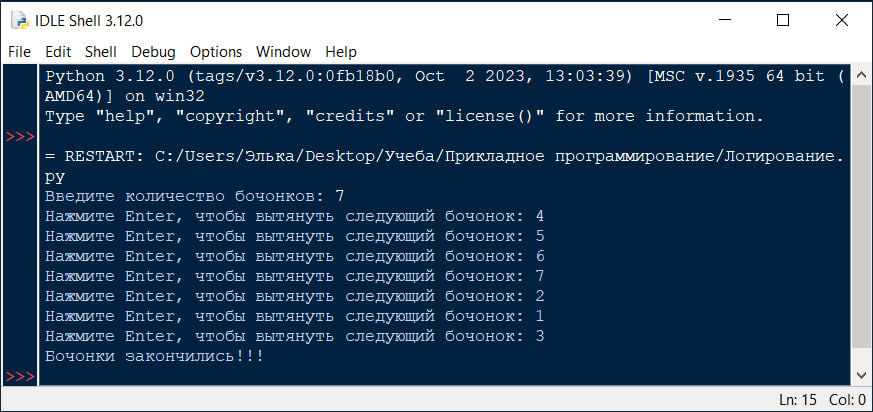
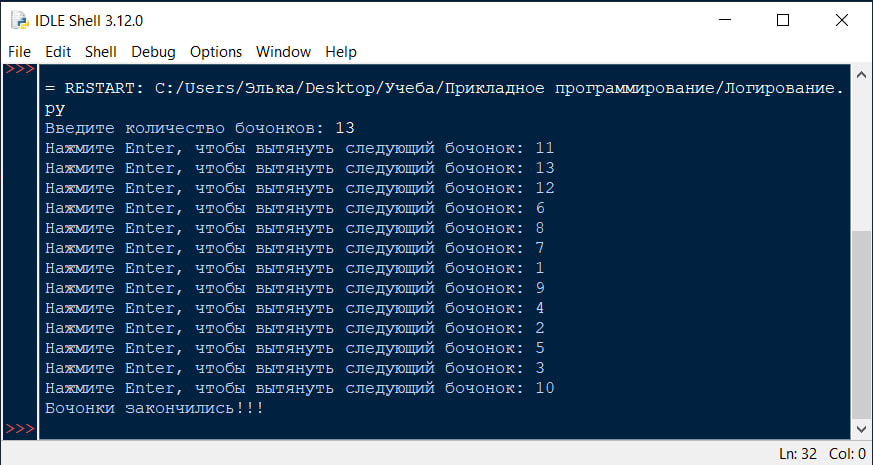
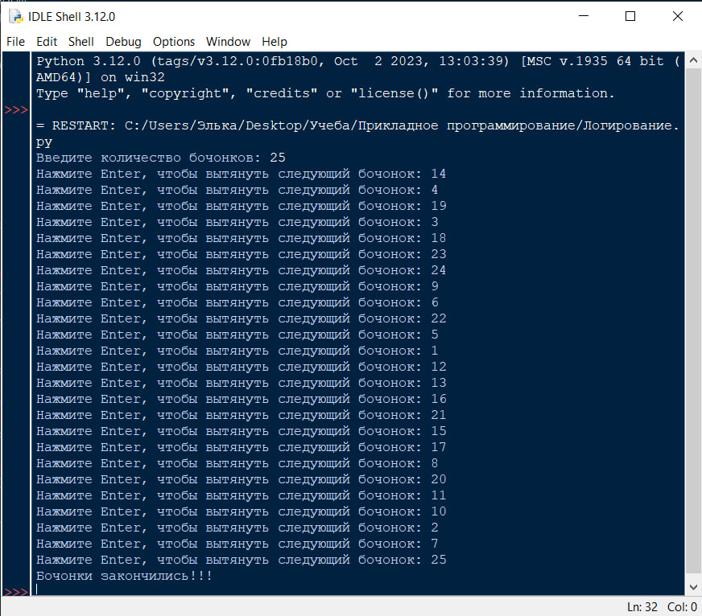
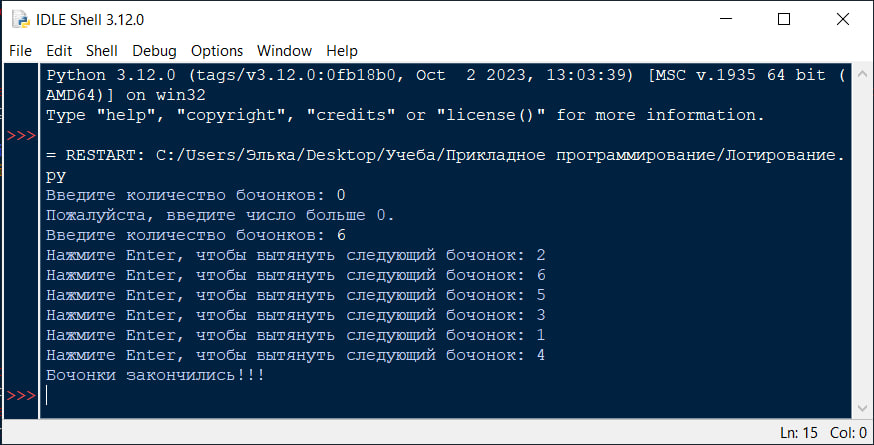

# Лабораторная №9

# Исполнитель
Громова Эльвира  
Группа ФТ-220007

# Задание
В мешке с бочонками N бочек (от 1 до N).  
Нажатие кнопки - вытаскивание очередного бочонка из мешка.  
Вытянутые бочонки убираем в сторону (т.е. каждое число может выпасть только 1 раз).

Написать на любом языке программу, реализующую данную задачу.
Код программы должен содержать комментарии для созданных функций и основных блоков, а также качественный диалог с пользователем для минимизации отказов при неправильном вводе.  
Входные данные: натуральное число N.  
Выходные данные: последовательность чисел от 1 до N в случайном порядке (по нажатию клавиши).  
Добавить вызовы логгера (добавлять записи в log-файл) во все методы программы. Должна быть отражена последовательность выпавших чисел!

# Среда разработки
Язык программирования: Python  
Среда разработки: IDLE

# Инструкция по работе
При открытии файла Логирование.py необходимо ввести количество бочонков.
Запустить программу, нажимая ENTER будут выводиться номера бочонков.

# Тесты
Выполнение программы  

Тест №1 (N = 7)

Тест №2 (N = 13)

Тест №3 (N = 25)

Тест №4 (Проверка ошибки ввода)

